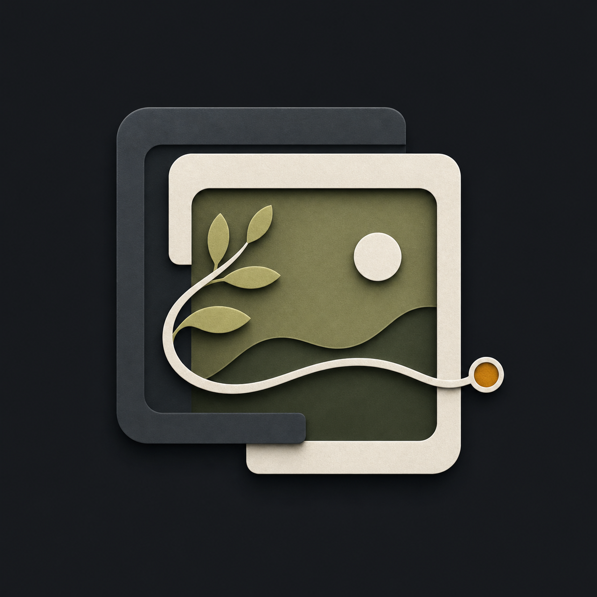
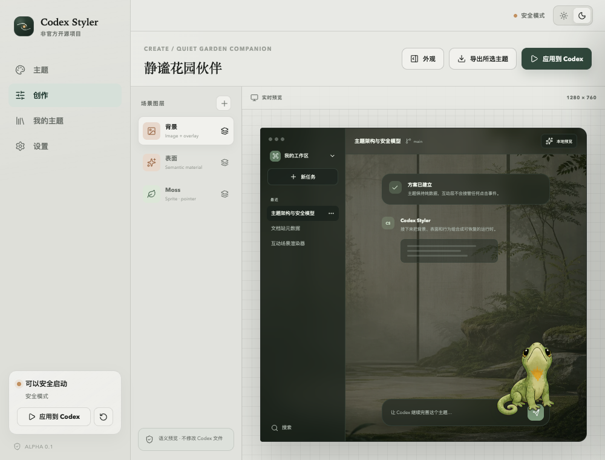

  

<h1 align="center">Codex Styler</h1>

  <strong>Themes and interactive 2D scenes for OpenAI Codex Desktop.</strong> 
  Safe, reversible, local-first, and deliberately unofficial.

  <a href="README.zh-CN.md">简体中文</a> ·
  <a href="https://xuhuanstudio.github.io/codex-styler/">Website</a> ·
  <a href="https://xuhuanstudio.github.io/codex-styler/docs/getting-started/">Documentation</a>

  
  
  
  

> [!IMPORTANT]
> Codex Styler is in source-first Alpha. It already builds and runs locally, but unsigned preview binaries are not presented as stable releases. The v1 stable release is gated on real-device testing, macOS notarization, and Windows code signing.

## Why Codex Styler

OpenAI Codex Desktop already includes useful appearance controls and Pets. Codex Styler focuses on the layer they do not cover: image-led environments, restrained material styling, and replaceable 2D entities that can react to the pointer.

- **Reversible runtime:** launches Codex with a temporary loopback CDP session; never edits <code>app.asar</code>, application resources, or signatures.
- **Guided creator:** tune background focus, brightness, overlays, surfaces, radius, motion, and companion size without authoring CSS.
- **Open scene model:** themes declare <code>layers[]</code>, <code>entities[]</code>, a renderer, and behaviors instead of reaching into Codex DOM internals.
- **Data-only packages:** local raster assets and JSON; no scripts, arbitrary CSS, SVG, video, remote URLs, or executable fonts.
- **Local-first:** no account, telemetry, cloud sync, online store, or background network requests.
- **Bilingual from v1:** English and Simplified Chinese in the desktop app, repository, and documentation site.

## Built-in themes

| Theme | Direction | Interaction |
| --- | --- | --- |
| Native Refined | Low-distraction calibration of the native workspace | None |
| Nocturne Studio | Ink-dark architecture, smoked glass, and amber light | Subtle parallax |
| Quiet Garden Companion | Soft natural depth with an original gecko named Moss | 16-direction pointer gaze |

Every shipped image and sprite is original project artwork. The reference repositories are studied for ideas only; their assets and source are not redistributed.

## Run from source

### Requirements

- Node.js 22 or newer
- pnpm 11 or newer
- Rust stable
- OpenAI Codex Desktop for real runtime testing

~~~bash
pnpm install
pnpm check
pnpm tauri dev
~~~

Run only the browser-based interface:

~~~bash
pnpm dev
~~~

Run the bilingual documentation site:

~~~bash
pnpm dev:site
~~~

## Safety model

Codex Styler reserves a random port on <code>127.0.0.1</code>, starts the installed Codex executable with that temporary debugging port, validates the returned page target, and injects one idempotent scene root plus one style node. Restore removes both.

Unknown Codex versions use **safe mode**, which limits application to the isolated background and scene layer. Semantic UI overrides remain disabled until a versioned adapter is verified.

See [the security model](docs/security-model.md), [theme package specification](docs/theme-format.md), and [security policy](SECURITY.md).

## Theme format

A <code>.codex-styler-theme</code> file is a validated ZIP containing:

~~~text
theme.json
LICENSES.json
assets/*.png | *.jpg | *.webp
previews/*.png | *.jpg | *.webp
~~~

The public format identifier is <code>codex-styler-theme-v1</code>. The JSON Schema and TypeScript interfaces live in <code>packages/theme-core</code>.

Validate a manifest or package:

~~~bash
pnpm theme:validate path/to/theme.json
pnpm theme:validate path/to/theme.codex-styler-theme
~~~

## Project structure

~~~text
apps/desktop          React editor + Tauri desktop shell
apps/site             Astro bilingual website and documentation
packages/theme-core   Theme schema, validation, archives, built-in themes
docs                  Architecture, safety, assets, and decisions
~~~

The runtime is intentionally split into four boundaries:

1. Desktop manager
2. Theme engine
3. Versioned Codex adapter
4. Injected scene runtime

Theme packages never contain Codex selectors. Compatibility-sensitive behavior stays inside the adapter.

## Contributing

Read [CONTRIBUTING.md](CONTRIBUTING.md) before opening a pull request. Original themes, accessibility improvements, adapter fixtures, documentation, and real-device compatibility reports are especially useful.

Please report security issues through GitHub private vulnerability reporting, not a public issue.

## Status and roadmap

The current repository implements the Foundation and macOS prototype layers. The next public gates are:

- macOS Alpha with documented unsigned-preview warnings
- Windows 11 x64 Beta with real-device validation
- signed and notarized v1 Stable on both platforms

See [ROADMAP.md](ROADMAP.md) and [COMPATIBILITY.md](COMPATIBILITY.md).

## Licensing and trademark notice

Code is licensed under [Apache-2.0](LICENSE). Original bundled artwork is licensed under [CC BY 4.0](ASSET_LICENSES.md).

Codex Styler is not affiliated with, endorsed by, or sponsored by OpenAI. OpenAI and Codex are trademarks of OpenAI, L.L.C.; their names are used only to describe compatibility.
