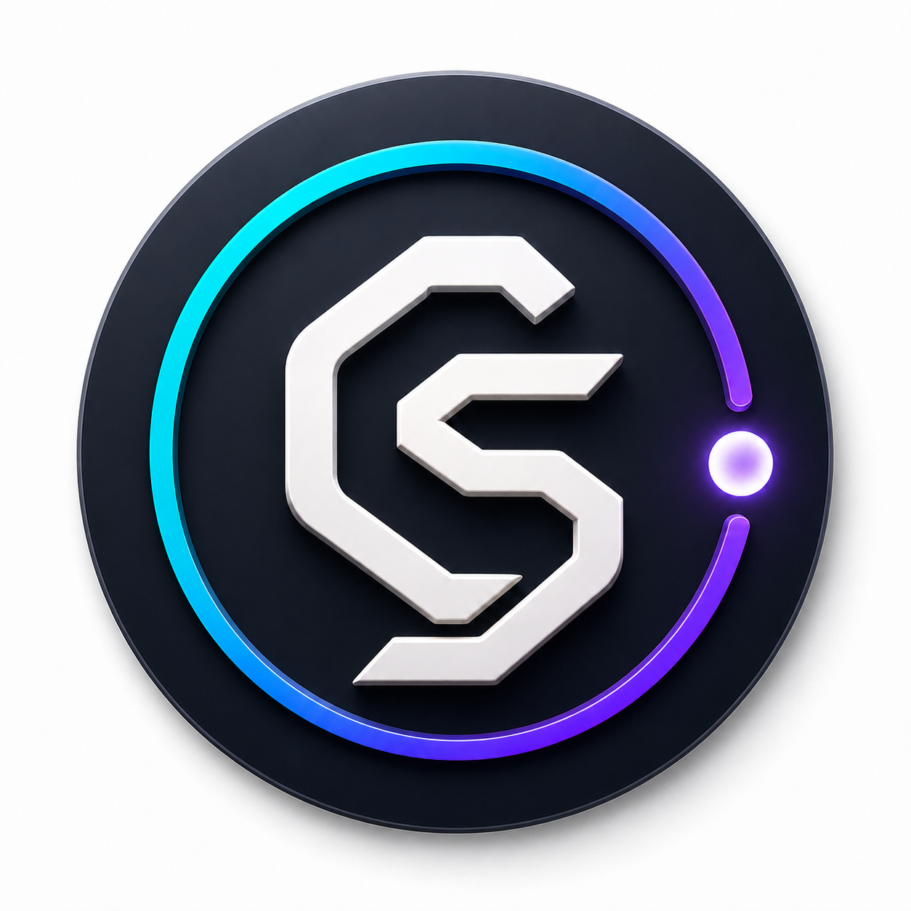
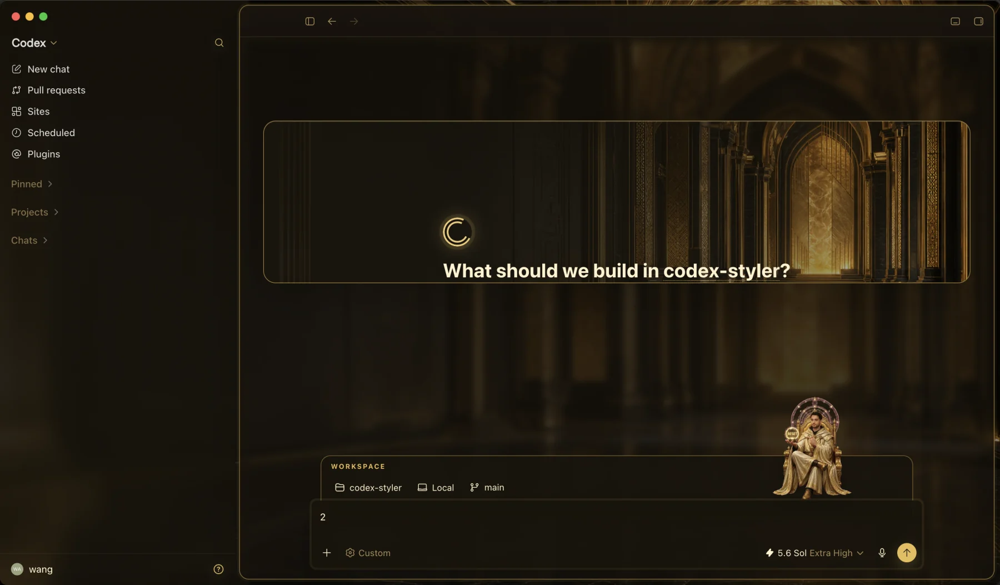
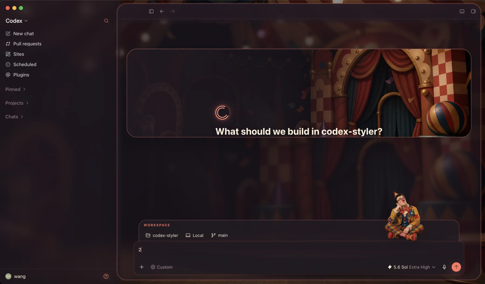
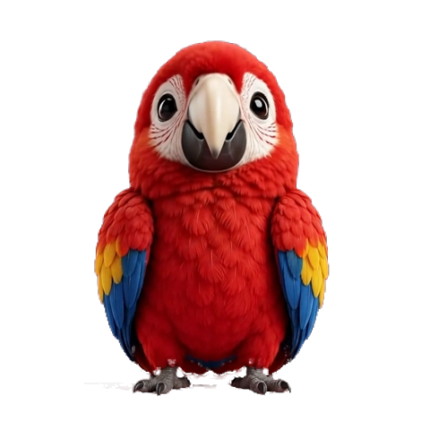
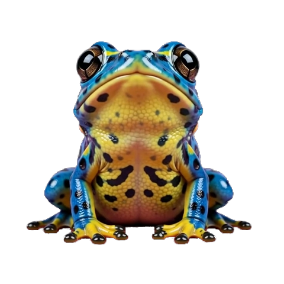
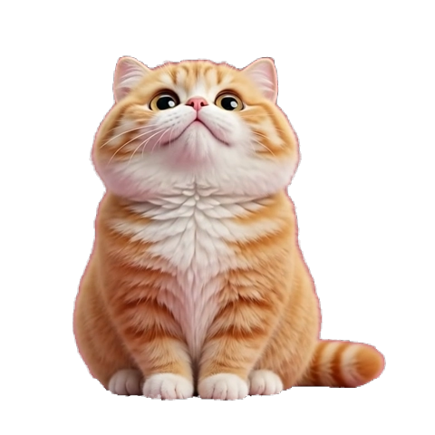
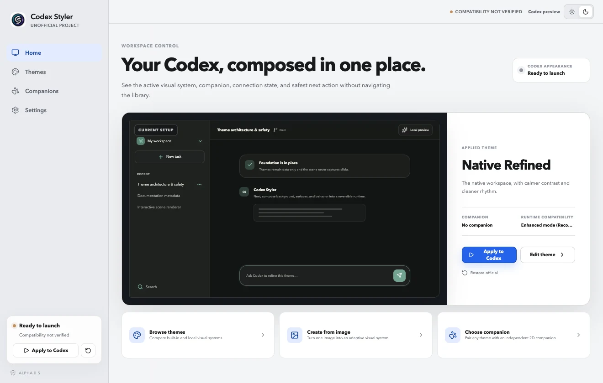
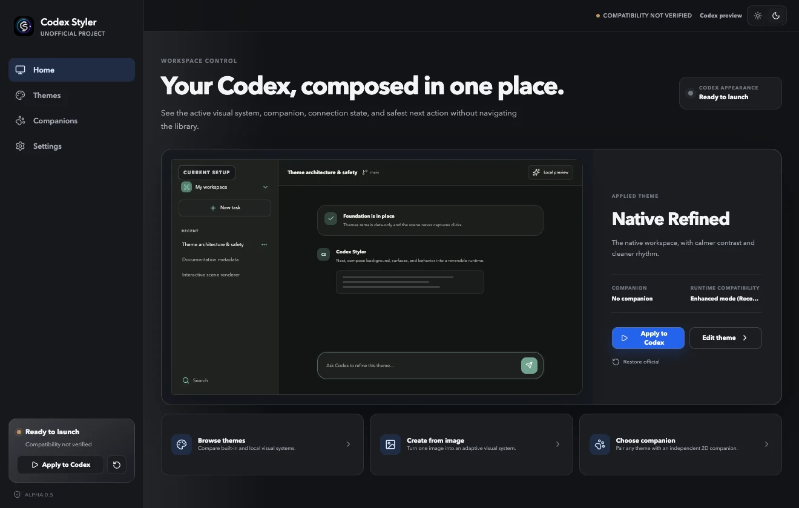

<p align="center">
  <picture>
    <source media="(prefers-color-scheme: dark)" srcset="apps/site/public/media/codex-styler-logo-dark.png">
    <source media="(prefers-color-scheme: light)" srcset="apps/site/public/media/codex-styler-logo-light.png">
    
  </picture>
</p>

<h1 align="center">Codex Styler</h1>

<p align="center">
  <strong>面向 OpenAI Codex Desktop 的开源 Codex 主题、皮肤与互动场景编辑器。</strong><br />
  安全、可逆、本地优先，并明确保持非官方身份。
</p>

<p align="center">
  <a href="README.md">English</a> ·
  <a href="https://github.com/xuhuanstudio/codex-styler/releases/tag/v0.1.0-alpha.7">下载 Alpha</a> ·
  <a href="https://xuhuanstudio.github.io/codex-styler/zh-cn/">项目网站</a> ·
  <a href="https://xuhuanstudio.github.io/codex-styler/zh-cn/docs/getting-started/">使用文档</a>
</p>

> [!IMPORTANT]
> Codex Styler 当前处于 Alpha 预览阶段。macOS DMG 采用临时 ad-hoc 签名但尚未公证，Windows EXE 尚未进行 Authenticode 代码签名；完成真实设备测试和双平台签名前不会标记为稳定版。



<p align="center"><sub><strong>金辉盛境 + Reset God</strong>——由 Codex Styler 实时应用到 Codex Desktop 的完整工作空间。</sub></p>

## 不只是更换背景图

Codex Styler 把 Codex 主题抽象为完整、协调的视觉系统，而不是简单换色或替换背景。语义表面、导航、图标、边框、层次、动画、输入区与可选互动伙伴会共同变化，同时保留用户熟悉的 Codex 基础骨架。



<p align="center"><sub><strong>滑稽马戏团 + Token Thief</strong>——相同的 Codex 骨架，不同的配色、材质、动态与伙伴方向。</sub></p>

## 认识互动伙伴

伙伴可以拖拽、会响应光标，并与主题保持独立。内置主题可以推荐默认搭配，但你仍可把任意伙伴与任意主题组合，也可以完全不使用伙伴。

<table>
  <tr>
    <td align="center" width="33%"><br><strong>Moss / 苔苔</strong><br><sub>好奇的变色龙</sub></td>
    <td align="center" width="33%"><br><strong>Reset God</strong><br><sub>鎏金与沉静</sub></td>
    <td align="center" width="33%"><br><strong>Token Thief</strong><br><sub>马戏与滑稽</sub></td>
  </tr>
  <tr>
    <td align="center"><br><strong>Pico / 皮可</strong><br><sub>灵动的鹦鹉</sub></td>
    <td align="center"><br><strong>Puddle / 泡泡</strong><br><sub>稳稳站立的青蛙</sub></td>
    <td align="center"><br><strong>Mochi / 糯米</strong><br><sub>温暖的橘猫</sub></td>
  </tr>
</table>

## 为什么做 Codex Styler

OpenAI Codex Desktop 已经提供基础外观设置和 Pets。Codex Styler 专注于它们没有覆盖的部分：以图片为主体的空间氛围、克制且可读的材质系统，以及能够响应光标的可替换 2D 实体。

- **可逆运行时：** 使用临时本机回环 CDP 会话启动 Codex，不修改 <code>app.asar</code>、应用资源或签名。
- **图片自适应创作：** 导入本地 PNG、JPEG 或 WebP 后，Styler 会分析明暗、主色、强调色与对比度，再匹配四套经过设计的视觉体系；随后可继续微调布局、图标处理、细节、表面、圆角、动态和伙伴位置，无需编写 CSS。
- **开放场景模型：** 主题声明 <code>layers[]</code>、<code>entities[]</code>、渲染器和行为，不直接依赖 Codex 内部 DOM。
- **纯数据主题包：** 仅允许本地位图和 JSON，不允许脚本、任意 CSS、SVG、视频、远程 URL 或可执行字体。
- **本地优先：** 无账号、无遥测、无云同步、无在线商店；可选的更新检查只访问 GitHub Releases。
- **从 v1 开始双语：** 桌面应用、GitHub 文档和网站完整支持英文与简体中文。

### 同一个管理器，亮色或暗色

Codex Styler 管理器可以跟随系统，也可以固定使用亮色或暗色；管理器自身外观与实际应用到 Codex 的主题互相独立。

<table>
  <tr>
    <td align="center" width="50%"><a href="docs/media/manager-light.webp"></a><br><sub>亮色</sub></td>
    <td align="center" width="50%"><a href="docs/media/manager-dark.webp"></a><br><sub>暗色</sub></td>
  </tr>
</table>

## 内置主题

| 主题                         | 视觉方向                       | 互动                   |
| ---------------------------- | ------------------------------ | ---------------------- |
| Native Refined / 原生精修    | 对原生工作空间进行低干扰校准   | Moss + 克制动态        |
| Gilded Grandeur / 金辉盛境   | 黑曜石建筑与克制的鎏金华丽细节 | Reset God + 金色视差   |
| Merry Big Top / 滑稽马戏团   | 活泼马戏配色与圆润的舞台化表面 | Token Thief + 轻快动态 |
| Nocturne Studio / 夜曲工作室 | 墨色建筑、烟熏玻璃与琥珀光     | Moss + 电影感视差      |
| Quiet Garden / 静谧花园      | 自然层次与清晰可读的半透明表面 | Moss + 自然视差        |

互动伙伴与主题独立选择。原生精修、夜曲工作室和静谧花园默认推荐变色龙 **Moss**；金辉盛境默认推荐 **Reset God**；滑稽马戏团默认推荐 **Token Thief**；鹦鹉 **Pico**、青蛙 **Puddle** 和橘猫 **Mochi** 仍可从伙伴库自由选择。用户一旦选择其他伙伴或“不使用伙伴”，该选择就成为明确偏好，后续切换主题不会强制覆盖。每只视频生成伙伴都使用非线性方向校准，不会假设源视频匀速；自然的姿态变化会得到保留，同时所有帧共用同一无损透明裁剪和落脚线。伙伴可以自由拖拽或贴合到 Codex 的语义表面，并会在输入框高度变化时实时重新定位。

所有随项目分发的图片和序列帧都是原创资源。参考仓库只用于研究思路，不复制或重新分发其代码与素材。

## 下载 Alpha 0.7

- **[macOS 13+ / Apple Silicon — DMG](https://github.com/xuhuanstudio/codex-styler/releases/download/v0.1.0-alpha.7/Codex-Styler_0.1.0-alpha.7_aarch64-unsigned.dmg)**
- **[Windows 11 / x64 — 安装 EXE](https://github.com/xuhuanstudio/codex-styler/releases/download/v0.1.0-alpha.7/Codex-Styler_0.1.0-alpha.7_x64-unsigned-setup.exe)**

在 macOS 上打开 DMG，把 Codex Styler 拖入“应用程序”，首次启动时按住 Control 点击应用并选择“打开”。Windows 版因为当前 Alpha 尚无 Authenticode 证书，SmartScreen 可能显示提醒；继续前请先核对 Release 中的校验和与构建证明。不要全局关闭 Gatekeeper 或 SmartScreen。

[预发布页面](https://github.com/xuhuanstudio/codex-styler/releases/tag/v0.1.0-alpha.7)同时提供 SHA-256 校验文件、SPDX SBOM、构建证明、更新包、已验证范围和已知限制。本次 Alpha 暂不提供 Intel Mac 安装包。

## 从源码运行

### 环境要求

- Node.js 22 或更高
- pnpm 11 或更高
- Rust stable
- 真实运行时测试需要安装 OpenAI Codex Desktop

```bash
pnpm install
pnpm check
pnpm tauri dev
```

只运行浏览器版界面：

```bash
pnpm dev
```

运行双语文档站：

```bash
pnpm dev:site
```

## 安全模型

Codex Styler 在 <code>127.0.0.1</code> 上申请随机端口，使用这个临时调试端口启动已安装的 Codex 可执行文件，验证返回的页面目标，然后只注入一个可幂等管理的场景根节点和一个样式节点。“恢复官方界面”会删除二者。

默认的**增强模式**会先应用完整语义样式，包括导航、内容表面、输入区、弹窗和任务摘要面板，再检查实时锚点与最终样式。Codex 版本不同只作为信息提示，不直接判定失败；只有运行时健康检查发现真实的结构或渲染异常时才自动回退。**保守模式**始终把影响限制在隔离的背景与场景层。Codex 已运行时，Styler 会先显示确认面板，再发送正常退出请求并重新启动，绝不强制终止进程。

参阅[安全模型](docs/security-model.md)、[主题包规范](docs/theme-format.md)和[安全策略](SECURITY.md)。

## 主题格式

<code>.codex-styler-theme</code> 是经过严格校验的 ZIP：

```text
theme.json
LICENSES.json
assets/*.png | *.jpg | *.webp
previews/*.png | *.jpg | *.webp
```

公开格式标识为 <code>codex-styler-theme-v1</code>。JSON Schema 和 TypeScript 接口位于 <code>packages/theme-core</code>。

校验主题：

```bash
pnpm theme:validate path/to/theme.json
pnpm theme:validate path/to/theme.codex-styler-theme
```

## 项目结构

```text
apps/desktop          React 编辑器与 Tauri 桌面外壳
apps/site             Astro 双语网站和文档
packages/theme-core   主题协议、校验、归档与内置主题
docs                  架构、安全、素材和技术决策
```

运行时明确划分为桌面管理器、主题引擎、版本化 Codex 适配器和注入式场景运行时。主题包中不会出现 Codex 选择器，兼容性相关逻辑全部集中在适配器。

## 参与贡献

提交 Pull Request 前请先阅读 [CONTRIBUTING.md](CONTRIBUTING.md)。原创主题、无障碍改进、适配器测试夹具、文档和真实设备兼容报告尤其有价值。

安全问题请使用 GitHub 私密漏洞报告，不要创建公开 Issue。

## 状态与路线图

当前仓库已经实现 Foundation 与双平台 Alpha 打包链路。下一阶段发布门槛：

- 补齐 macOS Apple Silicon 与 Windows 11 x64 的真实设备验收
- 发布完成双平台代码签名的 Beta 安装包
- macOS 与 Windows 均完成签名、公证的 v1 Stable

详见 [ROADMAP.md](ROADMAP.md) 和 [COMPATIBILITY.md](COMPATIBILITY.md)。

## 许可证与商标说明

代码采用 [Apache-2.0](LICENSE)，原创内置素材采用 [CC BY 4.0](ASSET_LICENSES.md)。

Codex Styler 与 OpenAI 无关联，也没有获得 OpenAI 的认可或赞助。OpenAI 和 Codex 是 OpenAI, L.L.C. 的商标，项目仅以描述兼容性的方式使用相关名称。
